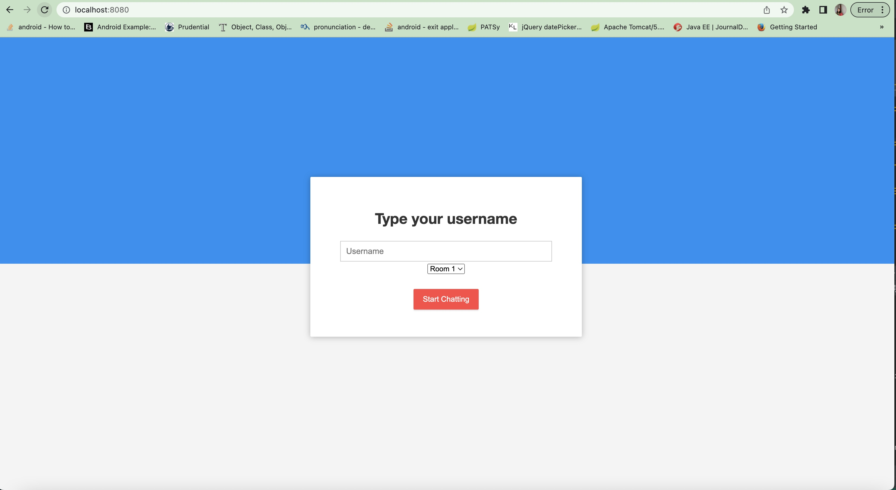

## Spring Boot WebSocket Chat Appplication

This is a basic chat room application. User can login into  different chat rooms  and instantly communicate with others in the room.

## Requirements

1. Java - 11

2. Maven - 3.x.x

## Steps to Setup

**1. Clone the application**

    git clone https://github.com/prachisahu25/websocket-chat.git

**2. Build and run the app using maven**

    cd websocket-chat
    mvn package
    java -jar target/websocket-demo-0.0.1-SNAPSHOT.jar

Alternatively, you can run the app directly without packaging it like so -

    mvn spring-boot:run

**3. To run the application in local**
    Open the browser
    Enter the url : localhost:8080

